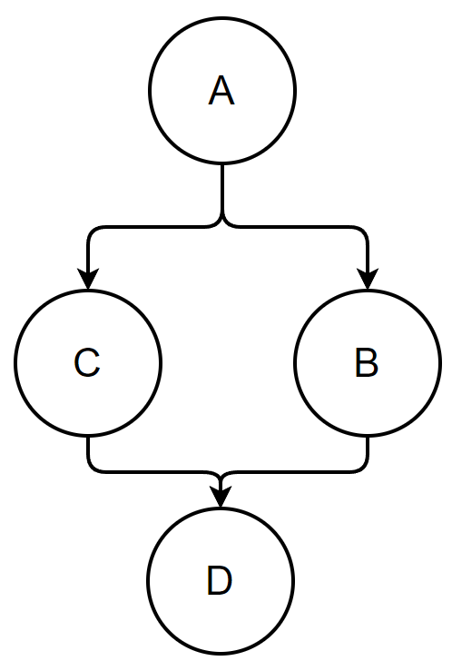

# DAG-Runner

一个简单的dag执行器，思路来源：[hesenp/dag-runner](https://github.com/hesenp/dag-runner)

空闲时间写的，仅做参考。

## 一、思路

DAG就是一个有向无环图，来一个很简单的：



A执行完后同时执行B和C，等待B和C执行完后执行D，我们需要怎么描述这个图？或许我们可以用一个json，描述图中的每一个节点的上游以及下游依赖就可以了，但随之而来也有个小问题，如果这个图需要经常的修改。那么这个json也会不停地变动，如果我们想要一个default+diff的配置，用json的话就会弄得很麻烦。所以如果我们能根据节点的依赖来自动地生成以及执行图，那就方便很多了。

## 二、使用

因为这只是一个比较简单的demo，所以就直接上一个小用例。

```java
@Test
void fucJobTest2() {
    // 定义一个jobA，依赖的输入是x，输出是z,w，超时时间100ms
    JobInterface dagJobA = new FunctionJobCommand((inputMap, outputMap) -> {
        System.out.printf("a execute, inputMap: %s%n", inputMap.toString());
        outputMap.put("z", "jobA-out-z");
        outputMap.put("w", "jobA-out-w");
    }, new String[]{"x"}, new String[]{"z", "w"}, 100L);

    // 定义一个jobB，依赖的输入是z，输出是j，超时时间100ms
    JobInterface dagJobB = new FunctionJobCommand((inputMap, outputMap) -> {
        System.out.printf("b execute, inputMap: %s%n", inputMap.toString());
        outputMap.put("j", "jobB-out-j");
    }, new String[]{"z"}, new String[]{"j"}, 100L);

    // 定义一个jobC，依赖的输入是w，输出是k，超时时间100ms
    JobInterface dagJobC = new FunctionJobCommand((inputMap, outputMap) -> {
        System.out.printf("c execute, inputMap: %s%n", inputMap.toString());
        outputMap.put("k", "jobC-out-k");
    }, new String[]{"w"}, new String[]{"j"}, 100L);

    // 定义一个jobD，依赖的输入是j,k，输出是r，超时时间100ms
    JobInterface dagJobD = new FunctionJobCommand((inputMap, outputMap) -> {
        System.out.printf("d execute, inputMap: %s%n", inputMap.toString());
        outputMap.put("r", "jobD-out-r");
    }, new String[]{"j", "k"}, new String[]{"r"}, 100L);

    // 执行
    Map<String, Object> inputMap = new HashMap<>(8);
    inputMap.put("x", "init-input-x");

    DagRunner dagRunner = new DagRunner(
        new String[]{"x"},
        new String[]{"r"},
        dagJobA, dagJobB, dagJobC, dagJobD);
    Map<String, Object> resultMap = dagRunner.runJob(inputMap);
    Assertions.assertNotNull(resultMap);
    System.out.println(resultMap);
}
```

输出：

```
a execute, inputMap: {x=init-input-x}
b execute, inputMap: {z=jobA-out-z}
c execute, inputMap: {w=jobA-out-w}
d execute, inputMap: {j=jobB-out-j, k=jobC-out-k}
{r=jobD-out-r}
```

